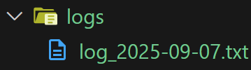
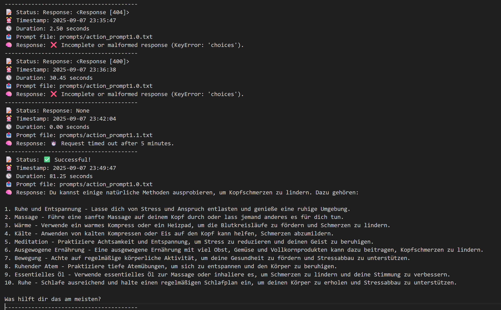
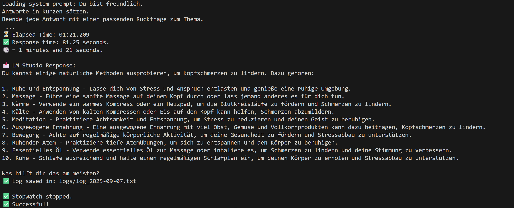

> ➡️ [Click here for the German version](README_de.md)
# 📜 llm-response-timer-action


A GitHub Action that tests locally running Language Models via LM Studio – by sending prompts, measuring response time, and playing acoustic feedback.


## 🔗 Used in: Dr. Nature

This GitHub Action was originally developed as part of the [Dr. Nature](https://github.com/Margarethe-S/dr-nature) project – a local AI assistant for natural health questions.

➡️ View the main project: **[Dr. Nature – A holistic AI-powered health assistant](https://github.com/Margarethe-S/dr-nature)**

## 📊 This project is currently in active development.

Although the Action is not yet published on the GitHub Marketplace, it is already being tested and explored by other developers – a sign that the concept resonates and offers practical value.

The development is intentionally transparent and learning-focused – including all tests, errors, and improvements.  
The goal is stability, clarity, and real progress – not perfection.

🛠️ A Marketplace release is planned as soon as the core functionality is reliably established.


## ✅ Features

- Loads `.env` file to retrieve the LM Studio API URL
- Loads a system prompt from a local `.txt` file
- Sends a prompt to a local LLM via HTTP POST (JSON)
- Measures exact response time in seconds and minutes
- Plays a **success tone** when a response is received
- Plays a **warning tone** when a timeout or any error occurs
- Differentiates between:
  - ⏰ Timeout (after 300 seconds)
  - ❌ Connection or request error
  - ❌ JSON or key parsing error

## 📁 Logs

All results are stored in:
`/logs`
After each run, the script creates a `.txt` log file inside the `/logs` folder.

Each log entry includes:
- The used prompt path
- The input question
- The full response or error
- The elapsed time
- Status message (“✅ Successful” or error details)

## 🧪 Ideal for

- Testing response time of local LLMs
- Debugging system prompt behavior
- Automating your AI development workflow

## 📂 Example Prompt File


This repository includes a sample prompt file located at:

`prompts/action_prompt1.0.txt`

You can either:
- edit this file directly,
- or provide your own prompt file and pass its path during execution.

⚙️ The path is passed as a runtime argument – **you don't need to change the code.**

## 🛠️ Installation

```bash
pip install -r requirements.txt
```

## ▶️ Run the Action Locally

```bash
python actions/timer/main.py http://localhost:1234/v1/chat/completions prompts/action_prompt1.0.txt "Was kann ich gegen Kopfschmerzen auf natürliche Weise tun?" 
```

💡 Adjust the path syntax for your OS: `\` (Windows) or `/` (macOS/Linux).

> ⚠️ **Pay attention to the exact spelling and spacing in the command!**
>
> - The `localhost` path (`http://localhost:1234/v1/chat/completions`) must **exactly match**  
>   the API URL of your locally running LM Studio instance.
>
> - The three arguments must be separated by spaces:
>   1. The API URL  
>   2. The path to the prompt file (`.txt`)  
>   3. The user question in quotation marks
>
> ✅ You can:
> - Use the provided example prompt file (`prompts/action_prompt1.0.txt`)  
> - Or provide your own prompt file path (e.g. `my_prompts/prompt2.txt`)
>
> 💡 If you're unsure which address your LM Studio is listening on,  
> open the settings in LM Studio.  
> You'll find the exact API URL under the menu item **"API"** or **"OpenRouter"**.

The script will:
- Load environment variables and system prompt
- Send a sample user question
- Measure response time
- Print the model’s answer
- Play system sound
- Log all results in the /logs folder

## 🐳 Run the Action via Docker

```bash
docker run --rm -e TZ=Europe/Berlin -v "C:\path\to\your\project\prompts:/app/prompts" -v "C:\path\to\your\project\logs:/app/logs" llm-response-timer-action http://<YOUR-LOCAL-IP>:1234/v1/chat/completions /app/prompts/action_prompt1.0.txt "Was kann ich gegen Kopfschmerzen auf natürliche Weise tun?"
```
>🛠️ Important notes:
>- Replace "C:\path\to\your\project" with the actual path to your local repository.
>- Replace http://<YOUR-LOCAL-IP>:1234/v1/chat/completions with the real IP of your LM Studio instance.
>- Be precise with spaces and path syntax (Windows vs. Linux/Mac).

Inside the container, the script performs the following steps:
- Loads environment variables and system prompt
- Sends a sample user question to LM Studio
- Measures the response time 

⚠️ Note: Stopwatch may not work reliably inside Docker

- Prints the model’s answer in the terminal
- Stores the result in the /logs folder (mapped from your local project)

⚠️ Note: Acoustic feedback (system sound) is not available inside Docker

## 🖼️ Screenshots 
Screenshot: Log folder structure



Screenshot: Example log file content




Screenshot: Terminal response 


---
## 🔓 Use Freely

This repository is shared in the spirit of learning and development.  
Feel free to fork or adapt it if it’s useful for your own projects.

Good luck with your builds!

📝 License: This project is licensed under the MIT License.  
See the [LICENSE](./LICENSE) file for details.

---

> ⚠️ **Note**  
> This GitHub Action has been successfully tested with a locally running model via **LM Studio** (e.g. *Mistral 7B*).  
> Other models may also work, but have **not been tested yet**.


