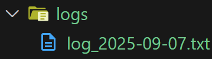
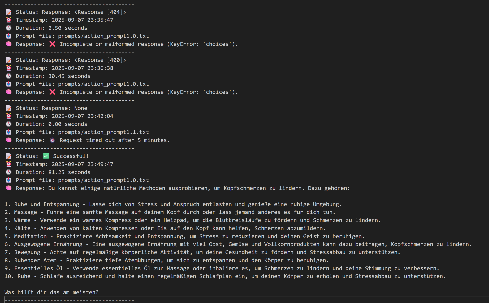
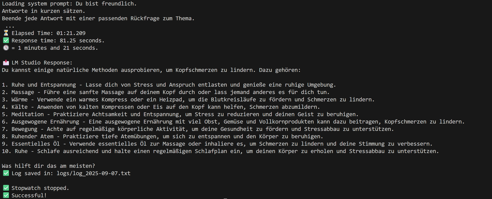

> ➡️ [Click here for the German version](README_de.md)
# 📜 llm-response-timer-action

[](https://www.gnu.org/licenses/agpl-3.0)


This GitHub Action tests a locally running language model via LM Studio by sending a prompt-based request, measuring the response time, providing acoustic feedback upon completion, and saving the results in a log file.


## 🔗 Used in: Dr. Nature

This GitHub Action was originally developed as part of the [Dr. Nature](https://github.com/Margarethe-S/dr-nature) project – a local AI assistant for natural health questions.

➡️ View the main project: **[Dr. Nature – A holistic AI-powered health assistant](https://github.com/Margarethe-S/dr-nature)**

## ✅ This project has reached stable core functionality.


The Action has been tested successfully in various local and Docker-based setups. It is now ready for public use and will be continuously improved based on user feedback.


Development remains transparent and learning-focused – including all tests, logs, and refinements.


✅ The GitHub Marketplace release is already live.

## ☁️ Cloud Compatibility:
This project is primarily designed for local and Docker-based environments. Cloud usage is possible if a locally hosted LLM endpoint is properly accessible.

## 🛠️ Features

- Loads the system prompt from a `.txt` file ℹ️ The file path must be correct depending on your setup (local or Docker).
- Sends a prompt-based request to a locally running LLM (e.g., LM Studio)
- Measures exact response time in seconds and minutes
- Plays a **success tone** when a response is received
- Plays a **warning tone** when a timeout or any error occurs
- Saves the response and timing in a log file
- Differentiates between:
  - ⏰ Timeout (after 300 seconds)
  - ❌ Connection or request error
  - ❌ JSON or key parsing error

## 📁 Logs

All results are stored in:
`/logs`
After each run, the script creates a `.txt` log file inside the `/logs` folder.

Each log entry includes:
- The used prompt path
- The input question
- The full response or error
- The elapsed time
- Status message (“✅ Successful” or error details)

## 🧪 Ideal for

- Testing the response time of locally running language models (e.g., LM Studio, o̲ll̲a̲m̲a̲)
- Debugging and fine-tuning system prompts
- Automating your local AI development workflow
- Quick functionality checks after prompt changes
- Error tracking with acoustic feedback and log files
- Comparing response times across models or configurations

## 📂 Example Prompt File


This repository includes a sample prompt file located at:

`prompts/action_prompt1.0.txt`

You can either:
- edit this file directly,
- or provide your own prompt file and pass its path during execution.

⚙️ The path is passed as a runtime argument – **you don't need to change the code.**

## 🛠️ Installation

```bash
pip install -r requirements.txt
```

## ▶️ Run the Action Locally

```bash
python main.py http://localhost:1234/v1/chat/completions prompts/action_prompt1.0.txt "Was kann ich gegen Kopfschmerzen auf natürliche Weise tun?" 
```

💡 Adjust the path syntax for your OS: `\` (Windows) or `/` (macOS/Linux).

> ⚠️ **Pay attention to the exact spelling and spacing in the command!**
>
> - The `localhost` path (`http://localhost:1234/v1/chat/completions`) must **exactly match**  
>   the API URL of your locally running LM Studio instance.
>
> - The three arguments must be separated by spaces:
>   1. The API URL  
>   2. The path to the prompt file (`.txt`)  
>   3. The user question in quotation marks
>
> ✅ You can:
> - Use the provided example prompt file (`prompts/action_prompt1.0.txt`)  
> - Or provide your own prompt file path (e.g. `my_prompts/prompt2.txt`)
>
> 💡 If you're unsure which address your LM Studio is listening on,  
> open the settings in LM Studio.  
> You'll find the exact API URL under the menu item **"API"** or **"OpenRouter"**.

The script will:
- Load environment variables and system prompt
- Send a sample user question
- Measure response time
- Print the model’s answer
- Play system sound
- Log all results in the /logs folder

## 🐳 Run the Action via Docker

```bash
docker run --rm -e TZ=Europe/Berlin -v "C:\path\to\your\project\prompts:/app/prompts" -v "C:\path\to\your\project\logs:/app/logs" llm-response-timer-action http://<YOUR-LOCAL-IP>:1234/v1/chat/completions /app/prompts/action_prompt1.0.txt "Was kann ich gegen Kopfschmerzen auf natürliche Weise tun?"
```
>🛠️ Important notes:
>- Replace "C:\path\to\your\project" with the actual path to your local repository.
>- Replace http://<YOUR-LOCAL-IP>:1234/v1/chat/completions with the real IP of your LM Studio instance.
>- Be precise with spaces and path syntax (Windows vs. Linux/Mac).

Inside the container, the script performs the following steps:
- Loads environment variables and system prompt
- Sends a sample user question to LM Studio
- Measures the response time 

⚠️ Note: Stopwatch may not work reliably inside Docker

- Prints the model’s answer in the terminal
- Stores the result in the /logs folder (mapped from your local project)

⚠️ Note: Acoustic feedback (system sound) is not available inside Docker

## 🖼️ Screenshots 
Screenshot: Log folder structure



Screenshot: Example log file content




Screenshot: Terminal response 



## 🆓 Freely usable


This repository is provided for the purpose of learning and further development.  
You are welcome to fork or adapt it – just make sure to comply with the license terms.


⚠️ If you publicly use or distribute the project (e.g. as a web app or hosted service),  
you are required to make your own changes publicly available as well.

📜 License: This project is licensed under the GNU Affero General Public License v3.0 (AGPL-3.0).  
See the [LICENSE](./LICENSE) file for details.


---

> ⚠️ **Note**  
> This GitHub Action has been successfully tested with a locally running model via **LM Studio** (e.g. *Mistral 7B*).  
> Other models may also work, but have **not been tested yet**.


