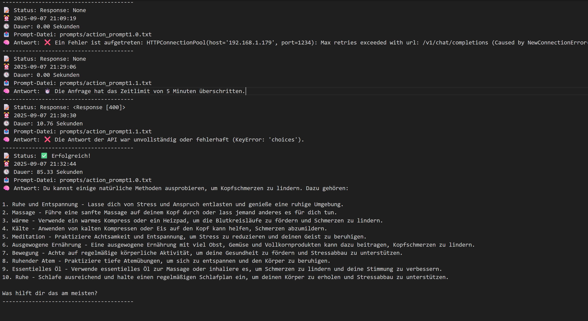
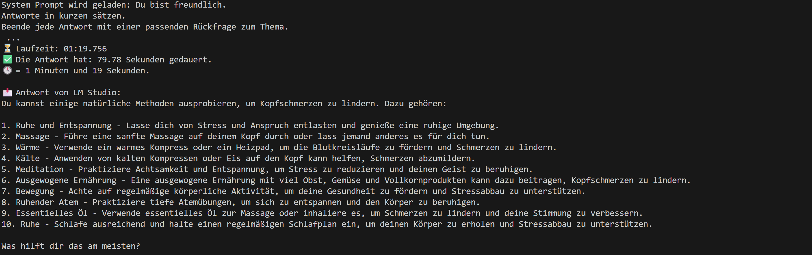

# 📜 llm-response-timer-action
> ➡️ [Hier geht’s zur englischen Version](README.md)

Diese GitHub Action testet ein lokal laufendes Sprachmodell über LM Studio, indem sie eine promptbasierte Anfrage sendet, die Antwortzeit misst und bei Abschluss ein akustisches Feedback ausgibt.

## 🔗 Einsatz in Dr. Nature

Diese GitHub Action wurde ursprünglich im Rahmen des Projekts [Dr. Nature](https://github.com/Margarethe-Techstarter/dr-nature) entwickelt – einer lokalen KI-Anwendung zur Beantwortung naturheilkundlicher Gesundheitsfragen.

➡️ Zum Hauptprojekt: **[Dr. Nature – A holistic AI-powered health assistant](https://github.com/Margarethe-Techstarter/dr-nature)**

## 📊 Dieses Projekt befindet sich aktuell in aktiver Entwicklung.

Obwohl die Action noch nicht im GitHub Marketplace veröffentlicht wurde, wird sie bereits von Entwickler*innen getestet und weiterverfolgt.  
Das zeigt: Die Idee trifft auf Interesse – und der Ansatz ist praxisrelevant.

Die Entwicklung erfolgt bewusst offen, lernorientiert und dokumentiert – inklusive aller Tests, Fehlerphasen und Verbesserungen.  
Der Fokus liegt auf Stabilität, Klarheit und echter Weiterentwicklung, nicht auf Perfektion.

🛠️ Eine Veröffentlichung im Marketplace ist geplant, sobald die Funktionalität verlässlich sichergestellt ist.


## ✅ Funktionen

- Lädt die `.env`-Datei, um die LM Studio API-URL zu erhalten
- Lädt ein Systemprompt aus einer lokalen `.txt`-Datei
- Sendet einen Prompt per HTTP POST (JSON) an ein lokal laufendes Sprachmodell
- Misst die genaue Antwortzeit in Sekunden und Minuten
- Spielt einen **Erfolgston**, wenn eine Antwort empfangen wurde
- Spielt einen **Warnton**, wenn ein Timeout oder Fehler auftritt
- Unterscheidet zwischen:
  - ⏰ Zeitüberschreitung (nach 300 Sekunden)
  - ❌ Verbindungs- oder Anfragefehler
  - ❌ JSON- oder Schlüsselverarbeitungsfehler

---

## 📁 Logs

Alle Ergebnisse werden gespeichert unter:  
`/logs`

Nach jedem Durchlauf erstellt das Skript eine Log-Datei im Ordner `logs/.txt`.  
Jeder Eintrag enthält:

- Den verwendeten Prompt-Pfad
- Die gestellte Nutzerfrage
- Die vollständige Antwort oder eine Fehlermeldung
- Die benötigte Zeit
- Eine Statusmeldung („✅ Erfolgreich“ oder Details zum Fehler)


## 🧪 Ideal geeignet für

- Testen der Antwortzeit lokal laufender Sprachmodelle
- Debugging von Systemprompts
- Automatisierung deines KI-Entwicklungs-Workflows


## 📂 Beispiel-Prompt-Datei

Speichere deinen Prompt zum Beispiel in:
`prompts/action_promt1.0.txt`

Du kannst den Pfad in der `main.py` anpassen – direkt über die Variable `prompt_path`.

## 🛠️ Installation

```bash
pip install -r requirements.txt
```

## ▶️ Aktion lokal ausführen

```bash
python main.py
```
Das Skript führt dann folgende Schritte aus:
- Lädt Umgebungsvariablen und den Systemprompt
- Sendet eine Beispiel-Nutzerfrage
- Misst die Antwortzeit
- Gibt die Antwort des Modells im Terminal aus
- Spielt einen Systemton ab
- Speichert das Ergebnis im /logs-Ordner


## 🖼️ Screenshots 
Screenshot: Log-Ordnerstrucktur


Screenshot: Beispiel-Inhalt einer Log-Datei



Screenshot: Terminalausgabe der Antwortzeit



---
## 🔓 Frei verwendbar

Dieses Repository wird im Sinne von Lernen und Weiterentwicklung bereitgestellt.  
Gerne darfst du es forken oder anpassen, wenn es dir bei eigenen Projekten hilft.

Viel Erfolg bei deinen Entwicklungen!

📝 Lizenz: Dieses Projekt steht unter der MIT-Lizenz.  
Details findest du in der Datei [LICENSE](./LICENSE).

---
 
> ⚠️ **Hinweis**  
> Diese GitHub Action wurde bisher erfolgreich mit einem lokal laufenden Modell über **LM Studio** getestet (z. B. *Mistral 7B*).  
> Andere Modelle könnten ebenfalls funktionieren, wurden jedoch **noch nicht getestet**.
